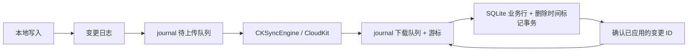

# iCloud 同步实现与验证

SwiftStore 使用 SQLite 保存业务数据，ChangeTracker 记录本地修改，SyncManager 协调本地应用。CloudKitSyncTransport 在 iOS 17+ 使用 CKSyncEngine，在 iOS 16 使用 CloudKit zone 操作，两者共用 journal 和冲突规则。调用端在迁移后执行一次 `manager.sync()`，即可启动后续本地写入和远端通知驱动的同步；`manager.stopSync()` 暂停网络同步，但保留本地追踪。iOS 16 的后台通知接入见 [iOS 16 兼容说明](../docs/ios16-compatibility.md)。

ChangeTracker 通过 pre-update hook 复制行的新旧值，在捕获时排除远端写入，语句完成后合并触发器事件。删除直接通过 hook 捕获。实现和平台要求见 [变更追踪说明](../docs/preupdate-change-tracking.md)。

## 本次梳理与补齐

| 环节 | 原有缺口 | 当前实现 |
| --- | --- | --- |
| 变更追踪 | ConnectionManager 迁移后没有启动追踪 | 迁移完成即启动，并补录启用同步前已有的数据 |
| 本地时钟 | 同毫秒写入可能产生相同游标 | 仅用于上传游标，在设备内严格递增、重启恢复下界；冲突改看业务行 updated_at |
| 数据编码 | 从 SQLite 列手工组 JSON，日期、空值和嵌套类型可能不一致 | 使用实体的 SQLite 解码和 Codable 编码 |
| 本地事务 | 业务回滚后仍有变更日志 | ConnectionManager 的事务写入失败时同时回滚对应日志 |
| 订阅 | 仅构造对象并标记成功 | 实际保存指定订阅，成功后交给 CKSyncEngine 使用 |
| 后台下载 | 没有 currentCycle 时下载结果丢失 | 所有下载都进入持久化 inbox，无须存在手动同步周期 |
| 下载确认 | 拉取游标领先本地应用，失败后无法重试 | 游标与 inbox 原子保存；业务行和删除时间标记事务提交后确认 |
| 上传恢复 | 待上传数据与引擎状态分开保存 | journal 保存待上传负载；重启以 journal 重建引擎待发送列表 |
| 上传竞争 | 旧请求成功时可能删除其间产生的新修改 | 以实际变更 ID 确认，保留同一实体更新的待上传版本 |
| 更新冲突 | 每次新建无版本记录；冲突后移除修改 | 保存 CKRecord 系统字段和 change tag；选出较新版本后应用或重试 |
| 删除冲突 | 实体删除不携带逻辑时间 | 上传带版本的删除标记，阻止旧离线修改复活数据 |
| 应用失败 | 吞掉错误后继续推进 | 失败项保留在 inbox；高 schemaVersion 数据等待应用升级 |
| 生命周期 | stop 后流永久关闭；启动和信号存在竞态 | 流可重建；同步互斥；运行期间的新信号触发后续一轮 |
| 账号变化 | 清空待上传数据 | 保留数据并停止；明确要求按账号隔离数据库和状态 |
| 文件异常 | 解码失败、保存失败被静默忽略 | 关键 journal/待上传数据损坏报错；保存失败后停止推进游标 |

## 数据流

`SyncTransport.enqueue` 成功代表持久化接收，SyncManager 才会保存本地上传游标。网络失败不会丢失已接收的工作，也不会把旧日志重复覆盖到正在重试的新修改上。

`syncNow` 固定本轮待上传修改 ID，全部裁决完成后才开始 fetch；上传期间的新修改留到下一轮。它返回待确认下载和上传回执，不清空队列。`acknowledge` 只删除调用方明确确认的 ID。SQLite 应用已成功但确认失败时，下载会幂等重放；transport 保证交付每个 key 的最新已知云端版本，SyncManager 不再比较本地时间。尚待上传的本地修改暂缓对应 key 的下载应用。

## CloudKit 记录格式

与 HTTP 共用 `SyncRecordEnvelope`：原生 recordName 使用相同的 SHA-256 key；只有以下自定义字段：

| 字段 | CloudKit 类型 | 含义 |
| --- | --- | --- |
| updatedAt | Int64 | Unix 毫秒修改时间 |
| payload | String | 完整 SyncChange JSON 的 Base64，小记录使用 |
| payloadAsset | Asset | 完整 SyncChange JSON 原始字节，大记录使用，与 payload 二选一 |

修改 ID、实体类型、同步键原值、操作、设备 ID、logicalClock、schemaVersion 和 createdAt 都收进 payload，不再单独保存。删除也有完整 payload。assetThreshold 按完整 Base64 内容的 UTF-8 大小判断，默认 700,000 字节。

新记录名固定 64 个十六进制字符，不能从名称反解实体或同步键。客户端解码完整 payload 后验证 key 和时间。记录格式采用上述统一实现，不包含旧实验格式的迁移或兼容读取。

## 冲突与删除

普通记录直接比较业务数据的 `updated_at`，删除比较删除时间，统一到毫秒精度。时间相同时保留云端已提交的版本，不按删除优先、内容、schemaVersion 或设备 ID 排序。这是整条记录的覆盖规则，不是逐字段合并。

时间字段保持 `REAL`。Date 默认值和自动更新触发器共用 `SQLiteTimestampSQL.now`，通过 `COALESCE` 优先使用 `unixepoch('subsec')`，不支持时回退到 `strftime` 计算毫秒精度的 Unix 秒，兼容 iOS 16 的 SQLite。正式迁移会更新已有表的旧秒级默认值及单独的 `subsec` 默认值，并修正新增时间列时临时使用的 `DEFAULT 0.0`；已有行的时间戳不会因默认值升级而重写。

普通记录使用业务表的更新时间，`__swiftstore_sync_tombstones` 只保存删除时间。已有秒级更新时间触发器通过正式迁移计划升级到毫秒级：Migrator 比较同名触发器定义，将删除和重建放在同一事务中，重复迁移不再产生变更；startTracking 只补录存量数据并启动追踪。接收相同时间的冲突更新不会被本地触发器改成接收时间。

`logicalClock` 用于本地变更日志的增量上传游标，不参与冲突判断。设备 ID 应在每个安装实例中稳定保存，不能在设备间共用。

删除保存在完整不透明 payload 内，其中的客户端操作为 `delete`；外层仍是相同的 key、updatedAt、payload。物理删除 CloudKit 记录缺少删除时间，会报告错误。删除标记不会自动清理；在不知道所有离线设备进度时，清理会重新引入旧数据复活的问题。

`CKRecord` 的系统字段和已提交数据一起缓存在 journal 中，下载确认后仍保留，避免旧修改借用新 tag 覆盖云端。服务端冲突时，如果本地时间严格较新，使用返回的新版本信息重试；否则在上传阶段结束旧上传，记录携带服务器内容的 rejectedKeys。即使是同一修改 ID 的重试，时间相同也走这条拒绝修复路径，与 HTTP 一致。接下来优先正常 pull；缺失项再使用携带的内容，不需要额外查询。成功上传的版本及系统字段仍缓存以保护下载顺序。拒绝修改时，即使赢家以前确认过，也需要重新应用；迟到的旧回调不能覆盖更新的已知云端版本。拒绝项仅在对应版本成功应用后清除，上传回执确认不会清除尚未应用的修复任务。

两种后端共享 `SyncTransport` / `SyncCycleResult` 接口。CloudKit 通过 `SyncConflictResolver` 的时间规则和 change tag 条件写入实现裁决，HTTP 由自定义服务端执行同一规则；SyncManager 统一直接落库。接口约定和升级要求见 [统一同步后端接口](../docs/sync-backend-contract.md)。

## 存储和升级

- 每个账号、容器、zone 和本地数据库使用独立状态目录，放在本地 Application Support 中，不放进 iCloud Drive。
- `journal.plist` 是原子检查点，包含引擎状态、账号/容器绑定、待上传数据、待确认下载、回执、记录系统字段和 zone 初始化状态。
- 自定义状态存储必须实现 `loadJournal` / `saveJournal`，原子持久化完整状态。
- 云端账号改变或整个 zone 被删除时暂停同步，不自动删除本地业务数据，也不擅自把原账号数据上传到另一个账号。恢复原账号可继续；切换账号需由宿主应用选择对应的数据库和状态目录。
- 业务数据库、变更日志和 journal 作为一组管理。重置时仅删除一个状态文件不能保证完整重新上传，尤其不能修复已被删除的云端 zone。

## 宿主应用接入

完整代码示例见主 [README](../README.md#61-cloudkit-transport)。需要 CloudKit、Push Notifications 能力，并注册远程通知；iOS 后台接收还需要 Remote notifications 后台模式。首次启动和回到前台时可显式执行 `manager.sync()`。自动同步不是即时送达承诺，调度与暂时性网络错误重试由系统控制。

`CloudKitTransportConfig.automaticallySync` 默认为 `true`；设为 `false` 时可以手动驱动传输层以便调试。`ConnectionManager` 本地写入触发的同步仍可运行，完全暂停使用 `stopSync()`。通过 `await cloudTransport.lastError` 查询自动同步中的错误。

时间校验必须开启。`SyncOptions.ntpToleranceMs` 默认为 5000 毫秒（±5 秒），可以设置其他正数，但不再接受 `nil`、0 或负数。ConnectionManager 将同一阈值传给 CloudKit 的后台路径；直接使用 CloudKitSyncTransport 时，通过 `CloudKitTransportConfig.ntpToleranceMs` 设置阈值。

启动传输、每轮同步、后台上传批次、后台拉取和下载后的本地应用都校验 NTP 时间。校时失败或偏差超限时不上传、不应用数据，保留待处理队列并返回错误；时钟修复后可重新调用 `manager.sync()`。后台无法校时时拉取范围为空，避免拉取业务记录；数据库级通知/元数据仍由系统管理。

测试通过内部 task-local 测量源提供确定的 NTP 测量结果，真实的偏差判断照常执行。公开配置没有跳过校验的选项。

## 验证范围

自动测试覆盖：变更追踪启动、首次导入、事务回滚、停止/恢复、自动上传、时钟单调性、传输失败后重试、日期编码、updated_at 覆盖防护、时间偏差边界/校时失败/中途跳变、删除后旧更新重放、不可解码数据和高版本数据暂存、队列持久化与部分确认、旧回执与新上传竞争、CKRecord/CKAsset/删除标记转换、损坏状态和通知流重建。

本次未运行有签名和 iCloud 容器授权的设备间 CloudKit 测试。正式接入时需要在同一 iCloud 账号的两台设备上验证：

1. A 新增、修改、删除，B 前台和后台都能收敛到一致数据。
2. 两端离线编辑同一条记录，包括删除与更新；以不同顺序恢复网络，最终跟随云端版本。相同时间保留先提交者，不要求不同提交顺序选出相同内容。
3. 下载后、本地应用前终止应用；重启后继续应用，不遗漏也不复活旧版本。
4. 上传期间继续编辑同一条记录；最终云端保存最新版本。
5. 大于 assetThreshold 的负载能够上传、下载，正常完成/停止后临时文件清理。
6. 退出并恢复原账号、切换另一账号、删除远端 zone，验证停止与数据隔离路径。
7. 在 CloudKit Development 验证后，将记录类型和字段部署到 Production，再验证 TestFlight 构建。

本地业务库与独立变更日志库仍沿用仓库原有的双数据库设计：正常事务失败会一起回滚，但两个 SQLite 文件的提交不是跨文件的崩溃原子事务。若要求任意进程崩溃点下本地写入和日志完全原子，需要将日志迁入业务库中的 outbox；这与 CloudKit journal 的原子保存是不同层面的保证。

参考：[Apple CKSyncEngine 示例](https://github.com/apple/sample-cloudkit-sync-engine)、[自动同步与重试](https://developer.apple.com/documentation/cloudkit/cksyncengine-5sie5/configuration/automaticallysync)、[订阅配置](https://developer.apple.com/documentation/cloudkit/cksyncengine-5sie5/configuration/subscriptionid)。
