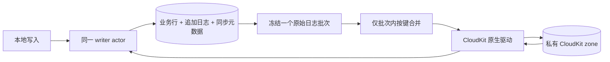

# CloudKit 同步架构

此文描述当前实现。同步仅面向 iCloud，业务持久化仍为 SwiftStore SQLite。旧 HTTP 客户端、服务端协议、可插拔 transport、独立 journal 和拒绝修复队列已移除。

## 所有权与持久化

`WritableConnectionActor` 是唯一可访问写连接及同步状态的拥有者；网络等待不占用 SQLite 事务。stopSync 更新会话 ID，使旧网络请求无法确认游标或写入下载。驱动通过弱引用桥接回 writer，避免互相保留数据库实例。

| 持久化内容 | 表 |
|---|---|
| 完整原始事件、change ID、递增 seq | __swiftstore_change_log |
| push_seq、原账号和 scope、原生下载状态、初始化标记 | __swiftstore_cloud_state |
| 已知 CloudKit 版本、change ID、删除状态、CKRecord system fields | __swiftstore_cloud_versions |
| 本地已知最大版本及删除标记 | __swiftstore_record_versions |
| 每个实体的首次扫描标记 | __swiftstore_sync_bootstrap |

日志是唯一可重放的 payload 来源。内存批次和网络结果丢失时，从确认水位重新读取。SDK 序列化可能包含 pending record IDs，但不能代替 `push_seq` 的服务端确认。当前保留所有日志和 tombstone，不做 GC。

## 写入与上传

业务修改及日志在同一 SQLite 事务内提交。pre-update hook 只复制数据，SQLITE_DONE 后处理最终快照、修正业务时间、追加日志，再释放原语句 savepoint。启用同步的 writer 使用 WAL + FULL。原始 SQL 事务尚未提交时，网络侧的读取和确认会等待。

读取 `seq > push_seq ORDER BY seq LIMIT batchSize` 后冻结批次，再按实体和同步键保留最后一条完整事件。原事件 ID、payload 和时间不变，早期事件的 seq 作为该合并项的覆盖范围。上传期间的新增编辑属于后续批次。旧导入历史若发生同键时间倒序，会先结束当前批次，避免合并掉时间更新的旧事件。

CloudKit 每项成功或被明确的已提交远端版本取代后，才成为终态。只推进原日志连续终态前缀，seq 有空洞不影响顺序。例如原始序列 A1、B2、A3：A3 成功覆盖 1、3，水位先到 1；B2 确认后才到 3。进程在此期间退出，较晚成功可能重新裁决，但不会跳过 B2。

保存使用 change tag 条件写入。服务端返回冲突版本时：本地业务时间较新，带新 tag 重试；否则采用服务端版本。真实网络错误保留事件并按 CloudKit retryAfter / 指数退避重试。永久错误阻塞进度，允许本地继续写入；修复代码、schema、权限或数据约束后显式重试，没有丢弃/跳过日志入口。

## 版本与下载

业务版本为 Unix 毫秒。真实本地编辑赋值 `max(now, 已知版本 + 1ms)`，相同内容写入不产生事件；删除与重建同键延续已知版本。CloudKit 的 `modificationDate` 只表示云端保存时间，不能参与离线编辑排序。

| 远端与本地业务时间比较 | 本地动作 |
|---|---|
| 远端更大 | 应用完整记录或 tombstone |
| 远端更小 | 保留本地，仍记录已知云端版本 |
| 时间相等、内容不同 | 应用 CloudKit 权威版本 |
| 时间和内容相同 | 不重复修改业务行 |

下载不等待本地 pending 上传，应用远端内容也不创建本地日志或新时间戳。未来 schema、未知实体、非法键、损坏 payload 和业务约束失败阻止整个下载页确认。

- iOS 16：每页业务数据、云端版本元数据和 zone token 在同一个事务提交。
- iOS 17+：串行处理 CKSyncEngine delegate，下载事件等待 writer 提交后才返回；后续 stateUpdate 保存不透明状态。任何应用或检查点写入失败都会弃用该引擎，忽略它之后的回调，从最后安全状态恢复。SDK 网络收发和取消不会在 delegate 锁内等待，避免互相等待。

## 生命周期与恢复

| 情况 | 行为 |
|---|---|
| 首次启用同步 | 仅为未覆盖的现存行追加原时间快照，每实体一次 |
| 重试、进程重启 | 重放同一日志 ID / payload，不刷新版本时间 |
| 普通下载 token 过期 | 清空该下载 token、全量重拉、保留本地数据和上传水位 |
| Operations 升级为 CKSyncEngine | 保留日志和上传水位，下载状态不互用，全量重拉 |
| iCloud 账号改变 | 保留数据库，拒绝静默重新绑定 |
| 已存在 zone 被删除 | 停止，不自动重建或重新导出旧库 |
| 物理删除 CloudKit record | 无可靠业务版本，报错；正常删除必须使用 tombstone |
| 停止同步 | 隔离旧回调，停止网络；本地日志继续追加 |

一份数据库只能由一个同步 writer 管理。不同账号、数据库和 zone 的状态不能混用。远端不存在某行，不意味着应删除本地行。

## 旧版升级与验证

参见 [CloudKit 迁移说明](../SwiftStoreSyncCloudTransport/README.md#旧版迁移)。先备份原文件，再在一个事务中导入旧日志、未完成工作和版本信息。保守重放，不信任旧“已入队”水位。旧文件中已经不存在的信息不能自动恢复。

测试覆盖原始 SQL 事务、RETURNING 中断、触发器副作用、日志失败、进程崩溃、固定批次合并、部分成功、下载检查点失败、账号变化、驱动升级及旧文件迁移。CloudKit 网络使用 fixture，系统调度和真实容器权限需要宿主真机验证。
